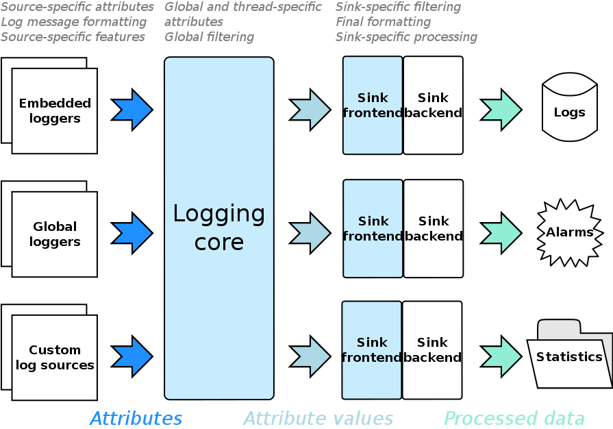

# Design Overview

Boost.Log 旨在高度模块化和可扩展，支持窄字符和宽字符日志记录。尽管窄字符和宽字符记录器提供类似的功能，但文档中主要描述窄字符接口。

该库由三个主要层次构成：日志数据收集层、处理收集数据的层，以及将前两层连接起来的中央枢纽。设计结构如图所示。

箭头指示了日志信息流动的方向——从应用程序的各个部分（左侧）到最终存储（右侧，如果有的话）。存储是可选的，因为日志处理的结果可以包括一些操作，而不实际存储信息。例如，当应用程序处于关键状态时，可以发出一个特殊的日志记录，经过处理后让用户在系统托盘图标上看到错误提示，并听到警报声。这是库的一个重要特性：它与收集和处理日志数据是正交的，实际上与日志记录包含的数据无关。这使得库不仅可以用于经典日志记录，还可以用于向应用程序用户指示重要事件和累积统计数据。

## Logging Sources

在左侧，您的应用程序使用日志记录器（特殊对象）发出日志记录，这些日志记录器提供格式化消息的流，最终将其写入日志。库提供多种不同类型的日志记录器，您还可以通过扩展现有的日志记录器自定义更多。日志记录器设计为不同特性的组合，可以以任意组合方式使用。您可以简单地开发自己的特性并将其添加到日志记录器中。您可以像使用其他日志记录器一样使用构建的日志记录器，可以将其嵌入到应用程序类中，或创建并使用日志记录器的全局实例。这两种方法各有优缺点。将日志记录器嵌入到某个类中可以区分不同类实例的日志，而在函数式编程中，通常更方便在某处有一个全局日志记录器并能够简单访问它。

## Attributes and attribute values

为了启动日志记录，日志源必须将与日志记录相关的数据传递给日志核心。这些数据的逻辑表示为一组命名的属性。每个属性基本上是一个函数，其结果称为“属性值”，并在后续阶段进行处理。一个属性的例子是返回当前时间的函数。它的结果——特定的时间点——就是属性值。

属性集有三种类型：

- **全局属性集**
- **线程特定属性集**
- **源特定属性集**

从上图可以看到，前两种属性集由日志核心维护，因此在启动日志记录时，日志源无需传递这些属性。参与全局属性集的属性附加到任何曾经创建的日志记录。显然，线程特定属性仅附加到由注册该属性集的线程创建的记录。源特定属性集由发起日志记录的源维护，这些属性仅附加到通过特定源创建的记录。

当源启动日志记录时，从所有三种属性集中获取属性值。这些属性值形成一个命名属性值的集合，进一步处理。您还可以向集合添加更多属性值；这些值将仅附加到特定日志记录上，不会与日志源或日志核心相关联。如您所见，相同名称的属性可以出现在多个属性集中。此类冲突按优先级解决：全局属性优先级最低，源特定属性优先级最高；在发生冲突时，较低优先级的属性将被忽略。

## Logging core and filtering

当属性值集合构成后，日志核心决定该日志记录是否将在汇中处理，这被称为过滤。可用两个过滤层：全局过滤首先在日志核心内部应用，以快速消除不需要的日志记录；汇特定的过滤第二次应用于每个汇。汇特定的过滤允许将日志记录导向特定的汇。此时，不重要的是哪个日志源发出了记录，过滤仅依赖于附加到记录的属性值集。

必须提到，对于给定的日志记录，过滤仅执行一次。显然，只有在过滤开始之前附加到记录的属性值才能参与过滤。某些属性值（如日志记录消息）通常在过滤完成后附加到记录；这些值不能用于过滤，它们只能由格式化器和汇使用。

## Sinks and formatting

如果日志记录通过至少一个汇的过滤，则该记录被视为可消费。如果汇支持格式化输出，这是日志消息格式化的时刻。格式化后的消息与组成的属性值集合一起传递给接受记录的汇。请注意，格式化是在每个汇基础上进行的，因此每个汇可以以其特定格式输出日志记录。

汇由两个部分组成：前端和后端。此划分旨在将汇的通用功能（如过滤、格式化和线程同步）提取到单独的实体（前端）。库提供了汇前端，用户通常无需重新实现它们。另一方面，汇后端是扩展库最可能的地方之一。汇后端实际处理日志记录。可以有一个汇将日志记录存储到文件中；可以有一个汇将日志记录通过网络发送到远程日志处理节点；还可以有一个汇将记录消息放入工具提示通知中——具体取决于实现。库已经提供了一些最常用的汇后端。

除了上述主要功能外，库还提供了各种辅助工具，例如属性、格式化器和过滤器（表示为 Lambda 表达式），甚至是库初始化的基本助手。您将在[详细功能描述](./detailed_features_description/core_facilities.md)部分找到它们的描述。然而，建议新用户从[教程](./tutorial/tutorial.md)部分开始探索库。